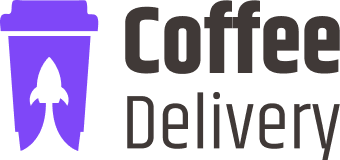
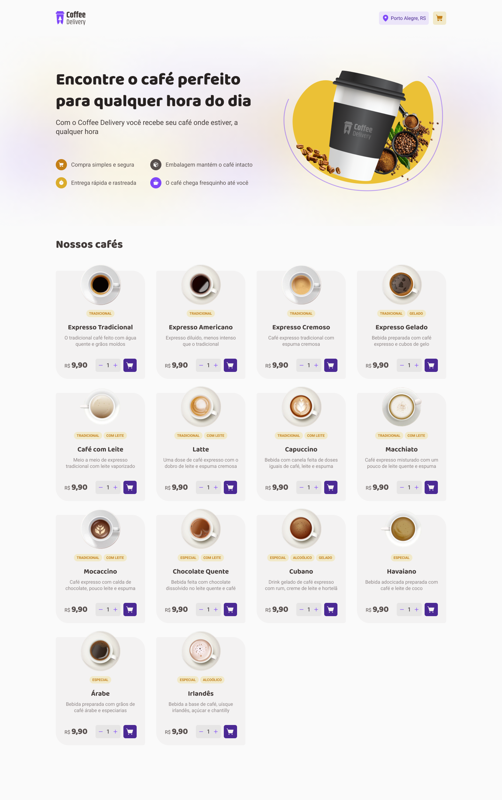
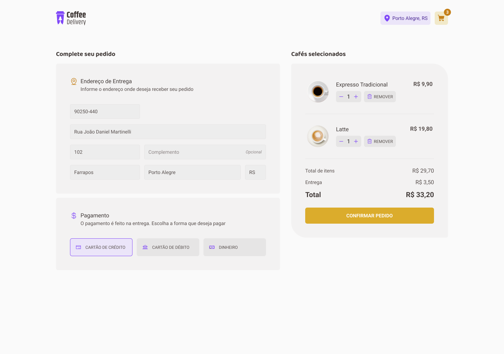
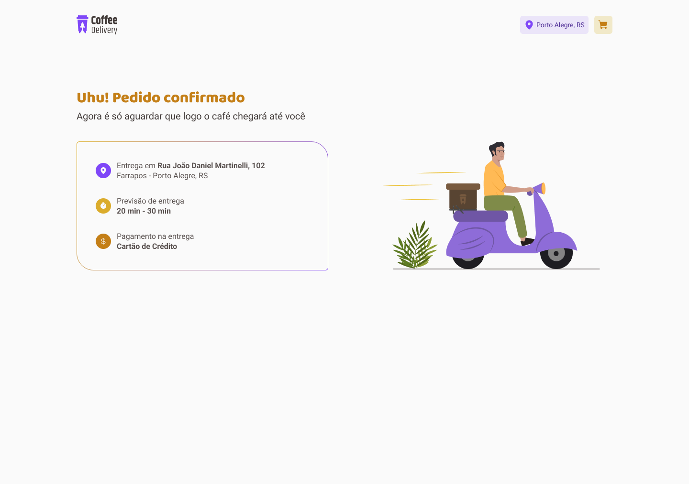

<h1 align="center">
  
</h1>

  
  

 

  

  
  

  

## 🔺 Demo
### [Live Demo, click here](https://coffee-delivery-jhonatan-bergmann.vercel.app/)

## 📦 Tech Stack

- Vite
- Typescript
- Style Components
- Immer
- Zod

[check in package.json](/package.json)

## 🔩 Installation

To install and run the project locally, follow these steps:

1. Install [**Yarn**](https://yarnpkg.com/) on your computer
1. Clone the repository `git clone https://github.com/jhonbergmann/coffee-delivery.git`
1. Navigate to the project directory: `cd coffee-delivery`
1. Install the dependencies: `yarn install`

## ⚙️ Usage

1. Start the development server: `yarn dev`
1. Now access the following url in your browser: `http://localhost:5173/`

## 📝 License

[MIT © Jhonatan Bergmann](https://github.com/jhonbergmann/coffee-delivery/blob/main/LICENSE)
